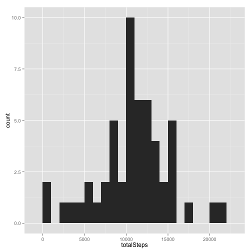
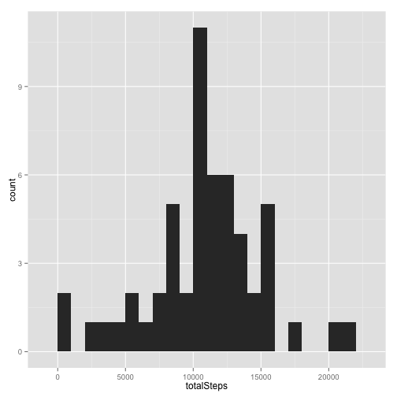

# Reproducible Research: Peer Assessment 1
By: Georgios Kaperonis  
Submitted: Sunday 17th August 2014

## Loading and preprocessing the data
Data is loaded from the csv file (which is unzipped if needed) into a data.table format in order to help with the future transformations.

```r
library(data.table)
library(ggplot2)
opts_chunk$set(echo=TRUE,  fig.path="figures/")
fileZip = "activity.zip"
fileTxt = "activity.csv"
if (!file.exists(fileTxt)) {
    unzip(fileZip) 
}
activity <- data.table(read.csv(fileTxt))
```

## What is mean total number of steps taken per day?

```r
activity_days <- activity[, list(totalSteps=sum(steps)), by = c("date")]
qplot(totalSteps, data=activity_days, geom="histogram", binwidth=1000)
```

 

```r
themean <- mean(activity_days$totalSteps, na.rm=TRUE)
themedian <- median(activity_days$totalSteps, na.rm=TRUE)
```
The mean is **1.0766 &times; 10<sup>4</sup>** and the median is **10765**.

## What is the average daily activity pattern?

```r
activity_interval <- activity[, list(averageSteps=mean(steps, na.rm = TRUE)), by = c("interval")]
ggplot(activity_interval, aes(interval, averageSteps)) + geom_line() + ylab("Steps (average daily") + xlab("Interval (5 minutes)")
```

 

```r
max_interval <- activity_interval[activity_interval$averageSteps==max(activity_interval$averageSteps)]$interval
```
On average across all days, the 5-minute interval of **835** contains the maximum number of steps.

## Imputing missing values


```r
count_missing <- sum(is.na(activity))
```
**2304** missing values were found. They will be filled in (imputed, code below) based on the daily average (for days with no missing valuea) for the interval.


```r
activity_estimated <- activity
activity_estimated[is.na(activity_estimated$steps)]$steps <- as.integer(activity_interval[activity_interval$interval == activity_estimated[is.na(activity_estimated$steps)]$interval]$averageSteps)
```

The code below creates the histogram and calculates mean and median for the new datase with the imputed values.

```r
activity_estimated_days <- activity_estimated[, list(totalSteps=sum(steps)), by = c("date")]
qplot(totalSteps, data=activity_estimated_days, geom="histogram", binwidth=1000)
```

 

```r
mean_filled <- mean(activity_estimated_days$totalSteps, na.rm=TRUE)
median_filled <- median(activity_estimated_days$totalSteps, na.rm=TRUE)
```
The mean is **1.0764 &times; 10<sup>4</sup>** and the median is **1.0703 &times; 10<sup>4</sup>**. These numbers are almost identical to non-imputed ones (mean of **1.0766 &times; 10<sup>4</sup>** and media of **10765**).

## Are there differences in activity patterns between weekdays and weekends?
There are clear differences in activity patterns between weekdays / weekends, with weekdays being more consistent (most likely due to work patterns).

```r
activity_estimated$datetype <- "weekday"
activity_estimated[weekdays(as.Date(activity_estimated$date, "%Y-%m-%d")) %in% c("Saturday", "Sunday")]$datetype <- "weekend"

activity_estimated_interval <- activity_estimated[, list(averageSteps=mean(steps, na.rm = TRUE)), by = c("datetype", "interval")]
ggplot(activity_estimated_interval, aes(interval, averageSteps)) + facet_grid(datetype ~ .) + geom_line(aes(color = datetype), show_guide=FALSE) + ylab("Steps (average daily)") + xlab("Interval (5 minutes)")
```

 
